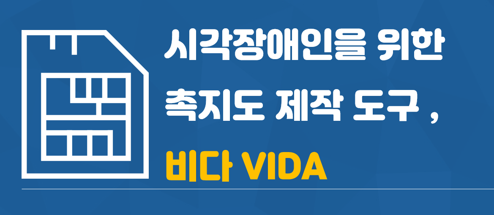
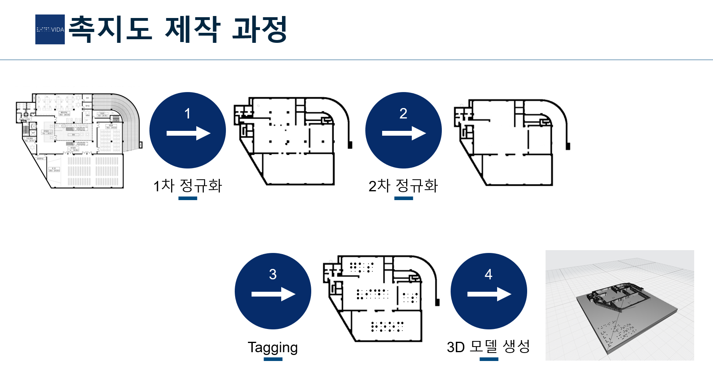
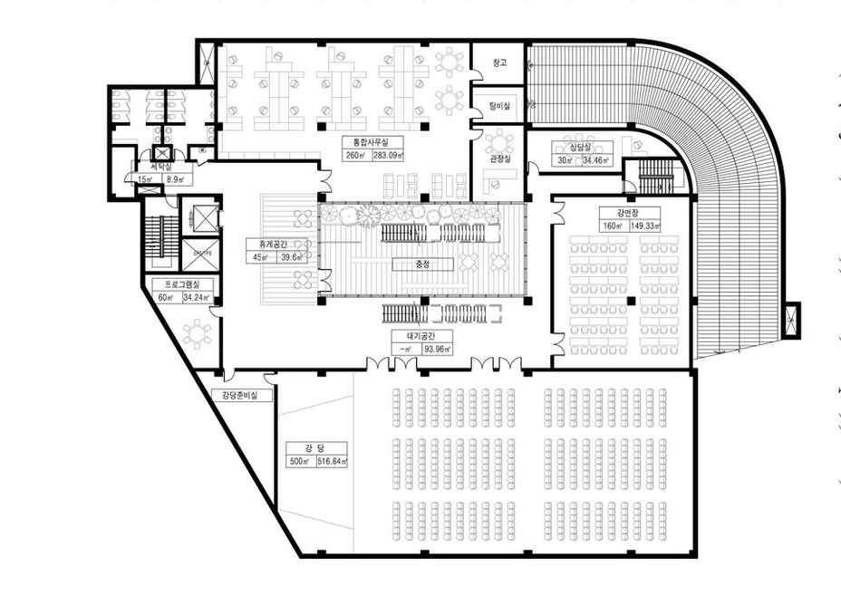
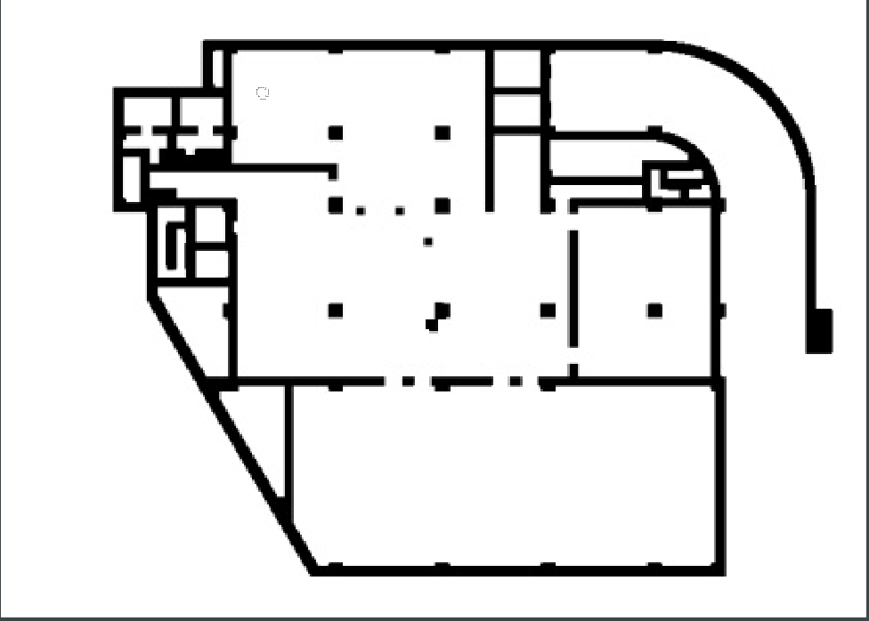
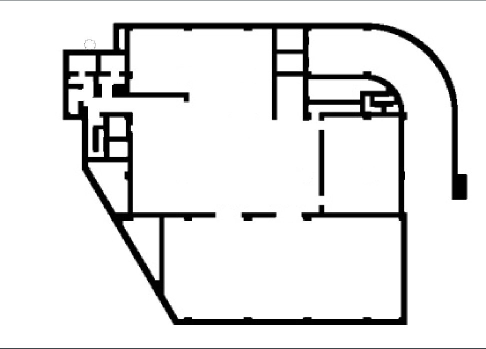
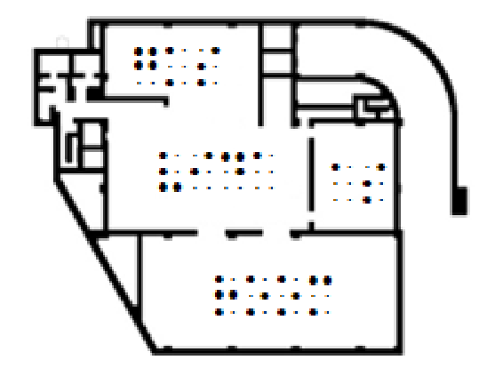

## 👩‍🦯VIDA : 시각장애인을 위한 촉지도 제작 도구

  

<h2 align="center">프로젝트 설명 자료</h2>

<table>
	<tr>
		<td width="50%">
			
		</td>
		<td width="50%">
			
		</td>
	</tr>
	<tr>
		<td align="center">
			<a href="https://www.youtube.com/watch?v=2zH5lD87E9M">프로젝트 소개 및 시연영상</a>
		</td>
		<td align="center">
			<a href="./asset/VIDA.pdf">프로젝트 소개 및 발표자료</a>
		</td>
	</tr>
</table>

# Overview

VIDA는 시각장애인을 위한 촉지도 제작 도구를 제작했습니다. 
3D 촉지도 모델 제작을 전문가가 아닌 일반인도 제작할 수 있게 만들 수 있게 인터페이스를 제공합니다.

# 모델 제작 과정

| 프로세스 | 설명 | 
| ------ | ------ | 
| 평면도 자동 정규화 작업 | 인터페이스에 사용자가 평면도 이미지(jpg,png,gif)를 입력하면 내부 기능에 의해 정규화 된다 (1차 정규화) |
| 평면도 수동 정규화 작업 | 1차 정규화된 이미지를 인터페이스에 출력하면 깔끔하게 정규화하지 못한 부분을 사용자가 직접 작업한다 (2차 정규화) |
| 태깅 작업 | 정규화가 완료된 평면도 이미지에 각 공간의 설명을 입력해준다. 공간 태깅이 끝나면 건물 태깅을 진행한다. |
| 3D모델 제작 작업 | 정규화와 태깅이 끝나면 모델을 제작한다. |

# Development

### 0. Process Start

<table>
        <tbody>
		<tr>
			<td colspan=2>
				<b> 🗺 초기 평면도 생성 및 선택 </b> 
			</td>
		</tr>
	<tr>
	<td rowspan="1">
</a>
</td>
            <td width="33%">  촉지도로 만들고 싶은 평면도는  일반적인 규격의 표준형이나 PPT로 생성한 간의 평면도 모두 가능하다 </td>
        </tr>
   </tbody>
</table>

### 1. 평면도 1차 정규화

<table>
        <tbody>
		<tr>
			<td colspan=2>
				<b> 👨‍💻 자동 정규화 작업</b> 
			</td>
		</tr>
	<tr>
	<td rowspan="1">
</a>
</td>
            <td width="33%">  1차 정규화는 내부 함수에 의해 자동으로 정규화된다  자동 정규화는 Morphology Transformation (dilation, erosion) 연산을 활용하여 제작했습니다.  </td>
        </tr>
   </tbody>
</table>

### 2. 평면도 2차 정규화

<table>
        <tbody>
		<tr>
			<td colspan=2>
				<b> 👨‍🏭 수동 정규화 작업</b> 
			</td>
		</tr>
	<tr>
	<td rowspan="1">
</a>
</td>
            <td width="33%">  1차 정규화에서 제거하지 못한 잡티 제거와  사용자 정의 맞는 평면도 제작을 위한 과정이다.  
	    그림판 기능을 응용해 만든 인터페이스에서 사용자가 간편하게 잡티를 제거하거나  사용자가 평면도의 벽을 생성 또는 제거 할 수 있다.
	</td>
        </tr>
   </tbody>
</table>

### 3. 태깅 작업

<table>
        <tbody>
		<tr>
			<td colspan=2>
				<b> 🏷 건물 구조 Tagging </b> 
			</td>
		</tr>
	<tr>
	<td rowspan="1">
</a>
</td>
            <td width="33%">  정규화가 끝난 이미지 위에 건물의 구조(방 이름,건물 이름)을 태그한다  
	Select Box를 제공하여 방의 크기와 위치를 정확하게 지정하고 간편하게 태그할 수 있다
	</td>
        </tr>
   </tbody>
</table>

### 4. 3D모델 제작 작업

<table>
        <tbody>
		<tr>
			<td colspan=2>
				<b> 🗿 3D Model 생성 </b> 
			</td>
		</tr>
	<tr>
	<td rowspan="1">
</a>
</td>
            <td width="33%">  정규화된 이미지를 기반으로 벽을 생성하고  태깅과정에서 생성된 건물의 구조  (좌표와 방이름)를 점자로 변환하여 Model에 넣어준다.   예시의 경우 
	    size : ( 211x211x21 /mm)  time : (16H)
	</td>
        </tr>
   </tbody>
</table>

## Versions

> ### v1.0.0 (released on 2022.06.27)
- 프로세스 전 과정 제작 완료
- Windows 64버전 실행파일 생성 완료

## Download

Windows 64-bit Version -> path

## Team

<table align="left" width="788">
<thead>
<tr>
<th width="100" align="center">사진</th>
<th width="100" align="center">성명</th>
<th width="100" align="center">깃허브</th>
<th width="175" align="center">이메일</th>
</tr> 
</thead>
<tbody>
<tr>
<td width="100" align="center">
	
</td>
<td width="100" align="center">김석현</td>
<td width="100" align="center">
	
</td>
<td width="175" align="center">
	
</td>
</table>
         

# Contribution

