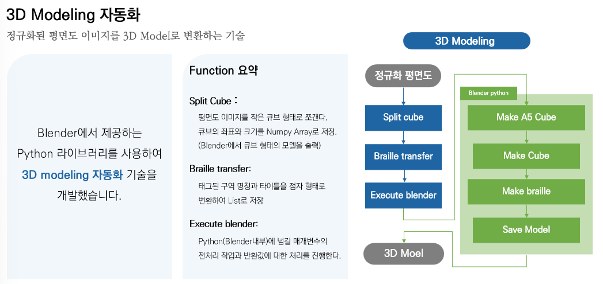

## 👩‍🦯VIDA : 시각장애인을 위한 촉지도 제작 도구

  

<h2 align="center">프로젝트 설명 자료</h2>

<table>
	<tr>
		<td width="50%">
			
		</td>
		<td width="50%">
			
		</td>
	</tr>
	<tr>
		<td align="center">
			<a href="https://www.youtube.com/watch?v=2zH5lD87E9M">프로젝트 소개 및 시연영상</a>
		</td>
		<td align="center">
			<a href="./asset/VIDA.pptx">프로젝트 소개 및 발표자료</a>
		</td>
	</tr>
</table>

# Overview
### 시각 장애인을 위한 촉각지도 제작 도구

VIDA는 3D 모델링 도구로 비전문가를 타겟으로 제작됐습니다. 
그림판 형식의 GUI 인터페이스를 제공하여 비전문가도 쉽고 빠르게 촉각 지도를 제작할 수 있습니다.

# 모델 제작 과정

| 프로세스 | 설명 | 
| ------ | ------ | 
| 입력 | 지도 이미지를 인터페이스에 연다 |
| 건물 선택 | 원하는 편의시설이 위치한 건물을 선택한다 |
| 편의시설 입력 | 편의시설이 종류 (병원, 약국 ..)을 입력한다 |
| 3D 모델 생성 | 주소지를 입력하고 생성 버튼을 누른다. |

# Development

### 0. input data

<table>
        <tbody>
		<tr>
			<td colspan=2>
				<b> 🗺 지도 이미지 입력 </b> 
			</td>
		</tr>
	<tr>
	<td rowspan="1">
</a>
</td>
            <td width="33%">    촉각 지도에 사용될 지도 이미지를 입력한다. 
				지도는 공공 데이터(국토교통부 지도API ) 기준 백지도 이미지를 사용한다. 
				이미지를 입력하면 건물과 도로가 구분되어 인터페이스에 출력된다. </td>
        </tr>
   </tbody>
</table>

### 1. 건물 택선택

<table>
        <tbody>
		<tr>
			<td colspan=2>
				<b> 👨‍💻 건물 선택</b> 
			</td>
		</tr>
	<tr>
	<td rowspan="1">
</a>
</td>
            <td width="33%">  인터페이스에 출력된 지도에서 원하는 편의시설(병원, 약국 등)이 위치한 건물을 선택한다.
        </tr>
   </tbody>
</table>

### 2. 편의시설 종류력입력

<table>
        <tbody>
		<tr>
			<td colspan=2>
				<b> 👨‍🏭 편의시설 입력</b> 
			</td>
		</tr>
	<tr>
	<td rowspan="1">
</a>
</td>
            <td width="33%"> 건물 선택이 완료되면 편의시설의 종류를 입력한다(병원, 약국 ..) 여러 편의시설을 입력하고 싶다면 색깔을 바꿔서 반복한다.  
	    (최대 3개의 편의시설까지 입력 가능)
	</td>
        </tr>
   </tbody>
</table>

### 3. 주소지 입력 및 모델 생성

<table>
        <tbody>
		<tr>
			<td colspan=2>
				<b> 🏷 모델 생성 </b> 
			</td>
		</tr>
	<tr>
	<td rowspan="1">
</a>
</td>
            <td width="33%">  모든 편의시설을 넣었다면, 주소지를 입력하고 모델 생성 버튼을 누른다.
	</td>
        </tr>
   </tbody>
</table>

### 4. 3D모델 

<table>
        <tbody>
		<tr>
			<td colspan=2>
				<b> 🗿 3D모델 제작 작업 </b> 
			</td>
		</tr>
	<tr>
	<td rowspan="1">
</a>
</td>
            <td width="33%">  3D Model파일은 다운로드 폴더에서 확인가능하다. 
	    size : ( 211x211x21 /mm)  time : (3H)
	</td>
        </tr>
   </tbody>
</table>

## architecture
### 이미지 정규화 - 건물 & 도로 구분 / 이진화 벡터화

### 인터페이스 - PYQT5

### 모델 생성 - Blender

## Versions

> ### v1.0.0 (released on 2022.06.27)
- 프로세스 전 과정 제작 완료
- Windows 64버전 실행파일 생성 완료

> v2.0.0 (released on 2022.11.01)
- 프로세스 전 과정 제작 완료
- Windows 64버전 실행파일 생성 완료
- 백지도 to 촉각지도

## Download

Windows 64-bit Version -> path

## Team

<table align="left" width="788">
<thead>
<tr>
<th width="100" align="center">사진</th>
<th width="100" align="center">성명</th>
<th width="100" align="center">깃허브</th>
<th width="175" align="center">이메일</th>
</tr> 
</thead>
<tbody>
<tr>
<td width="100" align="center">
	
</td>
<td width="100" align="center">김석현</td>
<td width="100" align="center">
	
</td>
<td width="175" align="center">
	
</td>
</table>
         

# Contest
## 22년 오픈데이터 포럼 해커톤 - 대상   행정안전부 장관상 🏆🏆

&nbsp;&nbsp;&nbsp;

